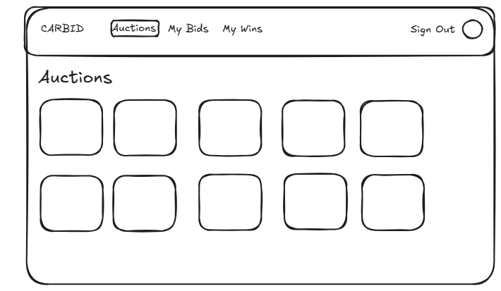
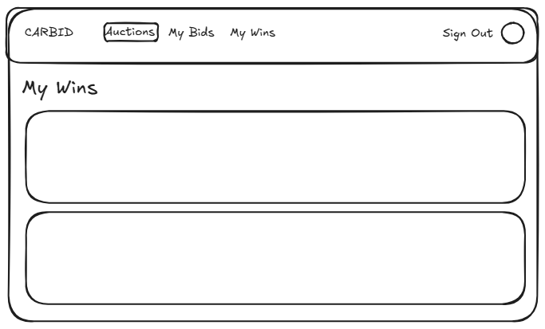
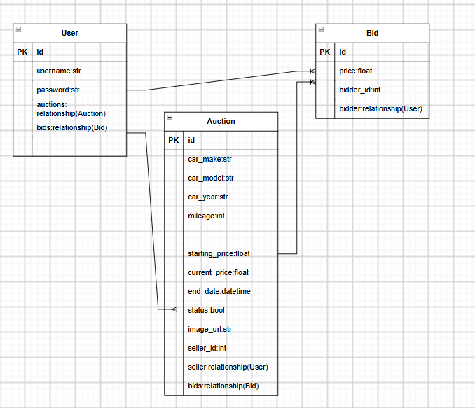

# CarBid - Live Car Auctions

### A platform that allows users to put up an auction for a car and allows other users to bid for the duration of the auction.

  

## User Stories

* As a User, i want to be able to put up a car of mine for auction

* As a User, i want to be able to set a starting price for each auction

* As a User, i want to be able to bid on other auctions i am interested in

* As a User, i want to be able to view a list of auctions that are currently active

* As a User, i want to be able to view a list of won bids

## Wireframes
### Auctions

### Bids

### Wins

## Entity Relationship Diagram

## Routes/Endpoints

| Method | Path | Purpose |
|---|---|---|
| **Auctions** | | |
| GET | `/auctions` | Get all auctions |
| GET | `/auctions/:auction_id` | Get single auction |
| POST | `/auctions` | Create auction |
| PUT | `/auctions/:auction_id` | Update auction |
| DELETE | `/auctions/:auction_id` | Delete auction |
| GET | `/users/:user_id/auctions` | Get auctions of a user |
| **Bids** | | |
| GET | `/auctions/:auction_id/bids` | Get bids for an auction |
| GET | `/bids/:bid_id` | Get bid |
| GET | `/auctions/:auction_id/winner` | Get winning bid |
| POST | `/auctions/:auction_id/bids` | Create a new bid |
| DELETE | `/bids/:bid_id` | Delete a bid |
| GET | `/users/:user_id/bids` | Get bids of a user |
