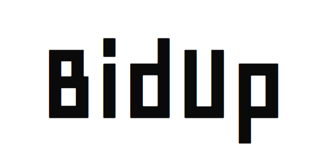
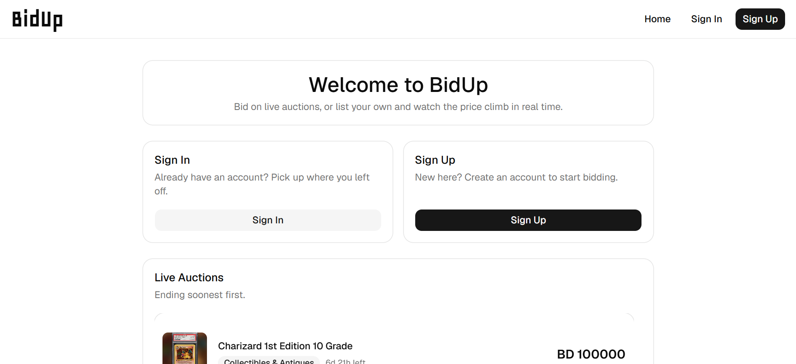
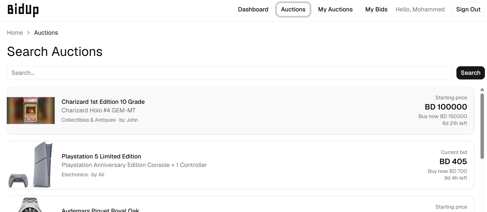

# BidUp - Live Auctions
## Overview
### A platform that allows users to put up an auction for a product and allows other users to bid for the duration of the auction.

## Screenshot/Logo

## User Stories

* As a User, i want to be able to put up a product of mine for auction

* As a User, i want to be able to set a starting price for each auction

* As a User, i want to be able to bid on other auctions i am interested in

* As a User, i want to be able to view a list of auctions that are currently active

* As a User, i want to be able to view a list of won bids

## Getting Started

* [Deployed App](https://bid-up-frontend.vercel.app)
* [Frontend Repository](https://github.com/Mohammed-M8/BidUp-Frontend) 
* [Backend Repository](https://github.com/Mohammed-M8/BidUp-Backend) 

## Wireframes
### Auctions

### Bids

### Wins

## Entity Relationship Diagram

## Routes/Endpoints

| Method | Path | Purpose |
|---|---|---|
| **Auctions** | | |
| GET | `/auctions` | Get all auctions |
| GET | `/auctions/:auction_id` | Get single auction |
| POST | `/auctions` | Create auction |
| PUT | `/auctions/:auction_id` | Update auction |
| DELETE | `/auctions/:auction_id` | Delete auction |
| GET | `/users/:user_id/auctions` | Get auctions of a user |
| **Bids** | | |
| GET | `/auctions/:auction_id/bids` | Get bids for an auction |
| GET | `/bids/:bid_id` | Get bid |
| PATCH | `/bids/:bid_id/accept` | Accept bid |
| DELETE | `/bids/:bid_id` | Delete a bid |
| GET | `/auctions/:auction_id/winner` | Get winning bid |
| POST | `/auctions/:auction_id/bids` | Create a new bid |
| GET | `/users/:user_id/bids` | Get bids of a user |

## Attributions
* Component Library [Shadcn/ui](https://ui.shadcn.com/)
* Toast Notifications [React-toastify](https://fkhadra.github.io/react-toastify/introduction/)

## Technologies Used

### Backend
**FastAPI, Cloudinary , Neon PostgreSQL, Postman, Swagger**
### Frontend
**React.js**
### Common
**Github , Postman**
## Next Steps
* Add Email on Bid Acceptance 
* Add Direct Messaging
* Add Payment Options
* Add In-App Notifications

